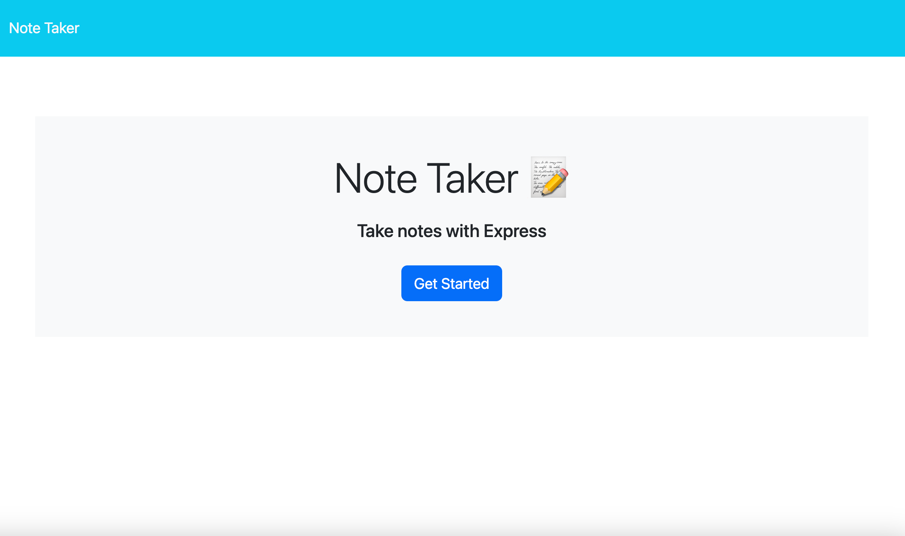
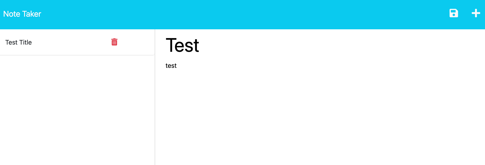
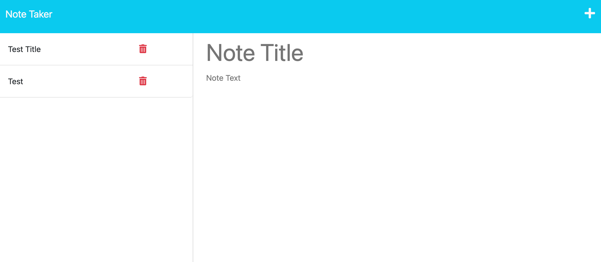

# Note Taker Application

## Description
This is an application that allows the user to add a title and a note to their saved notes. This application allows the user to create multiple new notes and refer back to them as needed.

## User Story

### AS A small business owner
I WANT to be able to write and save notes
SO THAT I can organize my thoughts and keep track of tasks I need to complete

## Problems Solved
During a busy day it is hard to keep track of all that needs to be done while also staying organized. This application provides a simple solution to allow the user to quickly and easily create notes and also refer back to them in the future.

* GIVEN a note-taking application
* WHEN I open the Note Taker
* THEN I am presented with a landing page with a link to a notes page
* WHEN I click on the link to the notes page
* THEN I am presented with a page with existing notes listed in the left-hand column, plus empty fields to enter a new note title and the note’s text in the right-hand column
* WHEN I enter a new note title and the note’s text
* THEN a Save icon appears in the navigation at the top of the page
* WHEN I click on the Save icon
* THEN the new note I have entered is saved and appears in the left-hand column with the other existing notes
* WHEN I click on an existing note in the list in the left-hand column
* THEN that note appears in the right-hand column
* WHEN I click on the Write icon in the navigation at the top of the page
* THEN I am presented with empty fields to enter a new note title and the note’s text in the right-hand column

## Usage

The following images show the application in action. This is a link to the deployed website: https://fierce-mountain-37204.herokuapp.com/

This image shows the landing page with a button to get started:

This image shows the user creating a new note:

This image shows that the new note has been saved:

 
## Contributors

Tyler Leeming https://github.com/TLeeming15
## Installation

To install dependancies: npm i 

## License

MIT